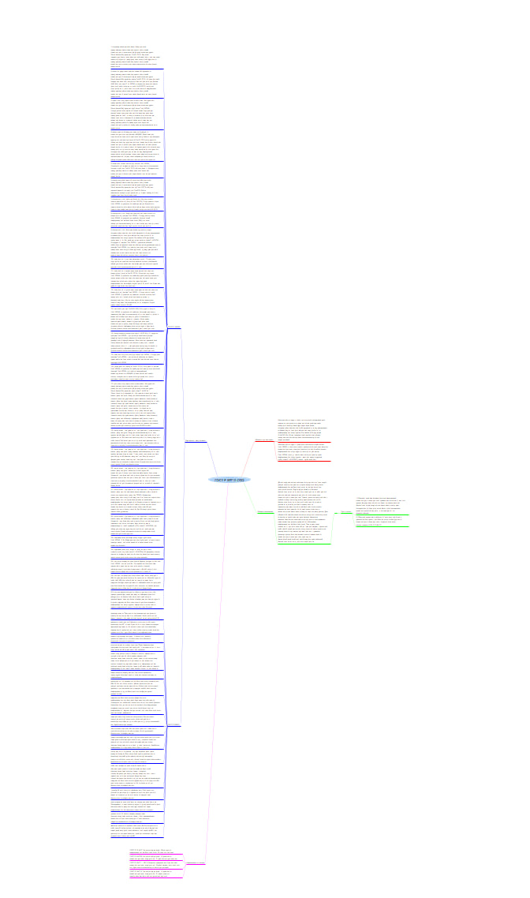
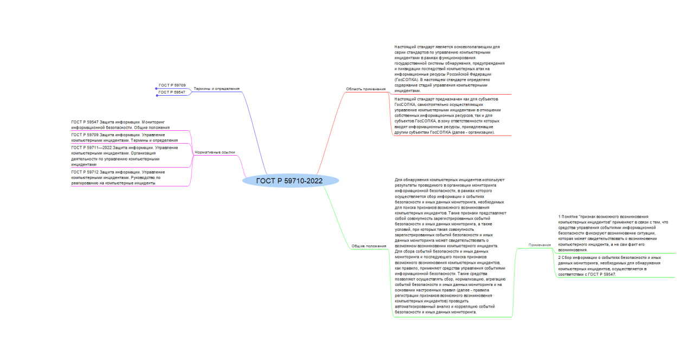
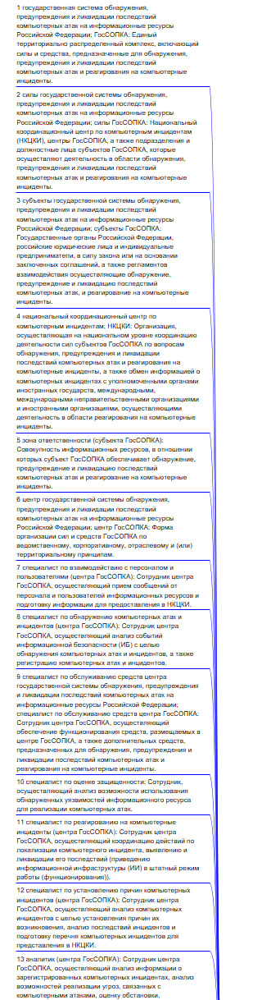
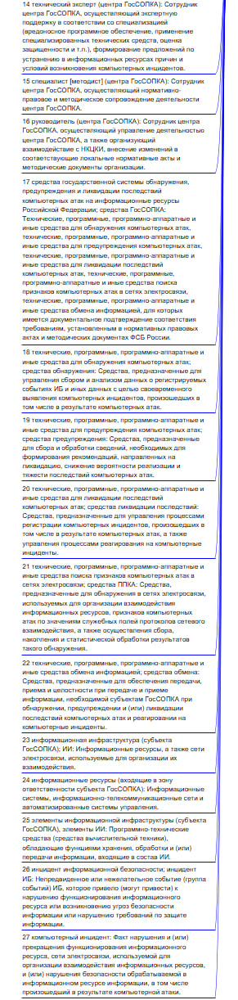
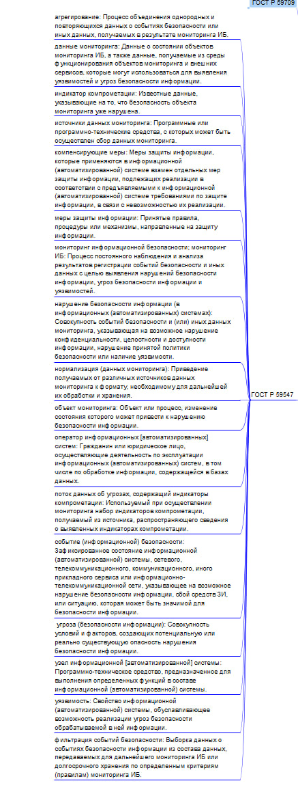

# Изучение ГОСТ

Федосимова Александра БИСО-03-20

## Цель работы

Изучить ГОСТ по защите информации и познакомиться с построением mind-карты

## Ход работы

1.  Для построения mind-карты был взят ГОСТ Р 59710-2022 Защита информации Управление компьютерными инцидентами. Ссылка на документ - https://docs.cntd.ru/document/1200194356

2.  Была использована программа Freeplane

3.  Результат 
     
     

## Оценка результата

Был изучен ГОСТ Р 59710-2022 Защита информации Управление компьютерными инцидентами. и была построена mind-карта в программе Freeplane.

## Вывод

Таким образом, был изучен ГОСТ и правила построения mind-карт.
